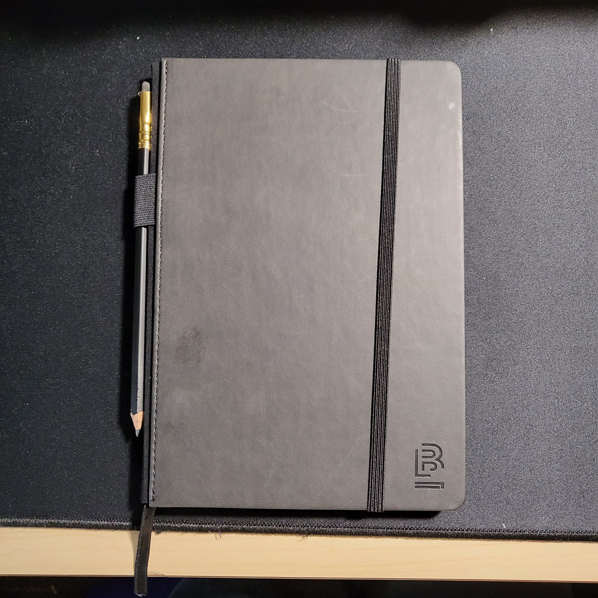

## Artifact 1: This blog
This blog itself is one of my artifacts. Here's an example of one of my [blogposts](https://minorenji.github.io/no-longer-human/).

The site started as more of a coding project but has now become more of a space for me to share my thoughts. In some ways, it's less about whether people are reading it than the fact that it is public. There is some satisfaction to be gained in the fact that other people *could* see what I write, regardless of whether they actually are reading it or not.

I'm currently working on making another website with a different aesthetic that's more focused on short stories.

*11/30 update: the new site has been completed and is available [here](https://mun-site.netlify.app/)*

## Artifact 2: "Hope"

"Hope" is a short story written by Okinawan author Medoruma Shun. I read this story as part of the Honors Okinawan literature class.

I went from not knowing anything about Okinawa to sympathizing deeply with the struggle of the Okinawan people against imperialism. This story in particular puts into words a sentiment that I have long harbored about resistance against oppression. 

> "Political power grows out of the barrel of a gun." 

In America, I am tired of attempts to reform the system by working within the system. I think that strategy is inherently flawed. The system must be destroyed and replaced. However, I've become rather apathetic about politics over the last year. Maybe this will change in the future.

## Artifact 3: Journal

I bought this journal at Elliot Bay Book Company when I visited Capitol Hill.

If the blog is the space for my public-facing, generalizable thoughts, the journal is a space for my inner, personal thoughts about myself and my life.

I've kept a journal in the past but I was never able to do so consistently. My mission this time is to fill up this journal.

I find that journaling is a very effective tool for self-reflection. It helps you consciously recognize the insights that have been brewing in the unconscious. It helps you put into words your feelings and articulate your thoughts in a more coherent way.

It helps me live more meaningfully.

---

[**Reflection**](https://docs.google.com/document/d/19xOA1QomsTYgJM7k8EfvWIWsnLYqtKCu/edit?usp=sharing&ouid=113226029678780241139&rtpof=true&sd=true)